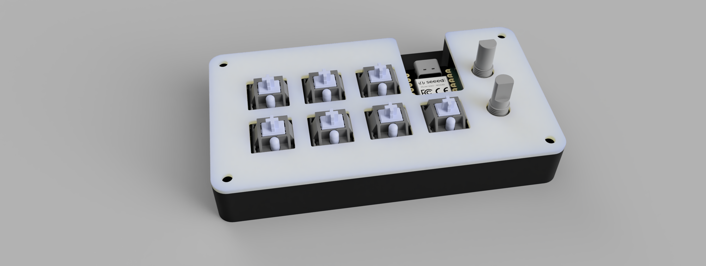

# MIDI (Pro) Pad
A hackpad built for [Hacklub's YSWS](hackpad.hackclub.com) that sends MIDI Control Messages to your DAW of choice. It features 2 rotary encoders, 9 switches, and 16 addressable LEDs.

## BOM
| Part | Quantity |
| - | - |
| XIAO RP2040 | 1 |
| EC11 Rotary Encoder | 2 |
| SK6812 MINI-E | 16 |
| MX-Style Switch | 7|
| Through-hole 1N4148 Diode | 9 |
| M3x16mm Screw | 4 |
| M3x5mx4mm Heatset Insert | 4 |
